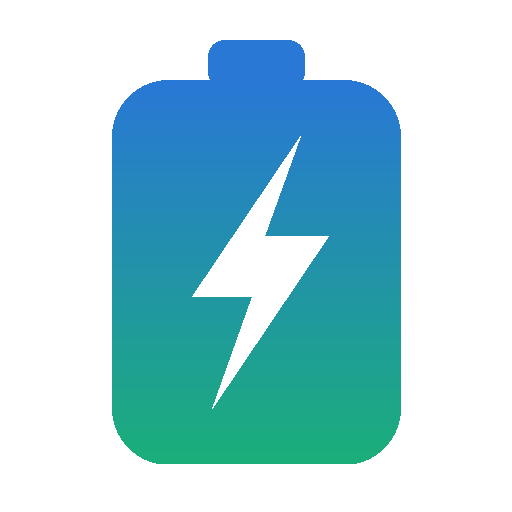

<div align="center">



# Wattson

**Explainable smart home battery control for Home Assistant**

[](https://github.com/hacs/integration)
[](#)
[](#)
[](#)

</div>

---

Wattson recalculates the most economical way to use your home battery every
few minutes, based on dynamic electricity prices, expected household demand,
solar production, battery limits, and conversion losses. It can publish the
plan as advice only or apply the first action directly to your battery.

Wattson is designed to be inspectable. Every decision includes the calculated
setpoint, the reason for the action, the expected state of charge, and the
inputs used by the planner.

## Highlights

- **Rolling-horizon DP planner.** A dynamic-programming planner selects the
  lowest-cost path across the available hourly price forecast.
- **Safe by default.** Wattson starts in shadow mode and does not control the
  battery until you enable the master switch.
- **No battery export by default.** Discharge is limited to household demand.
  Deliberate export requires the separate selling switch and price threshold.
- **EV guard.** Battery discharge and selling stop immediately when a configured
  EV charger starts drawing power.
- **Multi-brand control.** Built-in adapters support Zendure, Marstek, and
  generic number-based battery controls.
- **Live peak and solar assistance.** An optional real-time layer responds to
  unexpected demand peaks and surplus solar. It can also use conservatively
  forecast solar that would otherwise no longer fit in the battery to reduce
  grid import before that solar arrives.
- **Explainable operation.** Advice entities expose the complete plan, reason,
  next action, reserve, inputs, and recent decision history.
- **Local and dependency-free.** The planner runs locally in Home Assistant and
  does not require a cloud service or third-party Python package.

## Installation through HACS

1. Open **HACS → Integrations**.
2. Open the menu in the upper-right corner and choose **Custom repositories**.
3. Add this repository URL and select the **Integration** category.
4. Find **Wattson** in HACS and install it.
5. Restart Home Assistant.
6. Open **Settings → Devices & services → Add integration** and search for
   **Wattson**.

Only one Wattson instance is required for one battery and one planner.

## Initial setup

The four-step setup wizard creates the integration only after all required
measurements and control entities have been selected:

1. **Battery adapter** — Zendure, Marstek, or Generic.
2. **Measurements and forecasts** — price, state of charge, grid power, and
   optional EV/PV sources.
3. **Battery control** — the adapter-specific entities Wattson is allowed to
   control.
4. **Battery limits** — usable capacity, minimum state of charge, maximum charge
   and discharge power, and the optional selling threshold.

New installations do not inherit entity IDs from the developer's Home
Assistant instance. All settings remain editable later through the integration's
**Options** dialog.

### Required and optional sources

| Source | Expected value |
|---|---|
| Dynamic price sensor | Current import price and an hourly `forecast` attribute |
| Battery SoC | State of charge in percent |
| Grid/P1 power | Positive for grid import, negative for grid export |
| EV charger 1/2 | Optional charging power sensors |
| Current PV power | Optional current solar production |
| PV remaining today | Optional remaining solar-energy forecast |
| PV tomorrow | Optional next-day solar-energy forecast |
| Battery charge/discharge power | Optional telemetry used by the watchdog and load correction |

Power sensors and control numbers may use `W`, `kW`, or `MW`. Wattson
normalizes them internally to watts. Solar-energy forecasts may use `Wh`,
`kWh`, or `MWh`.

### Supported price forecast formats

Each item in the price sensor's `forecast` attribute may use either format:

```json
{"datetime": "2026-07-10T12:00:00Z", "electricity_price": 2450000}
```

The Zonneplan `electricity_price` value is divided by `1e7`, or:

```json
{"start": "2026-07-10T12:00:00Z", "price": 0.245}
```

Generic forecasts may use `datetime`, `start`, or `from` for the timestamp and
`price` or `value` for the price. Prices are normalized from common `€/kWh`,
`ct/kWh`, or `€/MWh` sensor units.

If the forecast begins at the next hour, Wattson inserts the current sensor
price for the active hour so that it does not execute a future setpoint early.

### Solar forecast treatment

The packaged forecast calibration is `pv_bias = 1.0`: forecast energy is not
scaled up. Current PV power is taken from the live power sensor. Forecast
quality remains installation-specific, so it should be checked against actual
daily production before active control is enabled.

Solar-backed real-time discharge is deliberately more conservative than the
hourly plan. It uses only the remaining complete hours of the current day,
counts 75% of forecast PV, subtracts expected household load and the battery's
existing free capacity, and keeps an additional 0.75 kWh uncertainty buffer.
Only the energy still expected not to fit in the battery becomes available for
early discharge.

## Battery adapters

### Zendure

The Zendure adapter controls the
[Zendure Home Assistant integration](https://github.com/FireSon/Zendure-HA).
It uses:

- an operation-mode `select`;
- a manual-power `number`;
- charge and discharge limit `number` entities;
- optionally the AC-mode `select` (strongly recommended: the device only
  charges from AC while it is set to `input` and only discharges on `output`,
  and Zendure's own manager does not switch it reliably — Wattson sets it to
  match every charge/discharge command);
- optional HEMS/AI-state and measured charge/discharge sensors.

Normal discharge uses a stable manual setpoint. Wattson reconstructs household
demand from P1 plus measured battery output, raises the setpoint immediately
when demand increases, and cuts it back immediately when P1 export appears.
This deliberately gives the real-time target a single owner: Wattson changes
the manager's manual-power entity, while the Zendure manager alone translates
that target to the device's physical `outputLimit`. Running native
`smart_discharging` alongside Wattson's tracking loop made both controllers
write the same target and caused repeated zero-output intervals. If the
battery's own HEMS/AI mode is active, Wattson continues publishing advice but
does not issue commands.

Zendure's native `smart_charging` mode owns the physical input limit while it
tracks solar export. Configure the Zendure Manager fuse group to the same
ceiling as Wattson's maximum charge power (for example `group2000` for 2000 W).
This lets native matching respect the configured ceiling without Wattson and
the vendor manager repeatedly overwriting each other's input limit. The input
limit, output limit, and AC-mode entities are also used for directional safety
stops and must refer to the same physical battery.

Low manual setpoints also require the Zendure manager to wake one idle device
at its official 50 W start threshold. The compatibility patch used by the
validated Home Assistant installation is versioned as
`patches/zendure_ha-manual-idle-kickstart.patch`. HACS updates of `zendure_ha`
can overwrite that third-party file; re-run the patch check after every such
update before enabling active control.

### Marstek

The Marstek adapter targets a Venus E/A/D through RS485/Modbus, for example
using the
[LilyGO ESPHome configuration](https://github.com/whyisthisbroken/marstek-lilygo-rs485)
or the
[Home Assistant Modbus configuration](https://github.com/reschcloud/marstek_venus_e_modbus_home_assistant).

Configure:

- a force-mode `select`, or a numeric mode entity using `0 = stop`,
  `1 = charge`, and `2 = discharge`;
- forced charge power;
- forced discharge power;
- optional measured charge and discharge power sensors.

English and Dutch mode labels are recognized. RS485 control mode must be
enabled on the battery before it will accept commands.

### Generic

The Generic adapter works with integrations that expose battery control through
Home Assistant `number` entities. Configure either:

- one signed power number where positive means charging and negative means
  discharging; or
- separate charge and discharge power numbers.

Optional measured charge/discharge sensors enable watchdog protection and allow
Wattson to remove the battery's own power from the household-load estimate.

Marstek and Generic controls use fixed setpoints rather than native P1
matching, so Wattson performs the matching in software. For the strongest
protection, also configure a hardware or vendor-app export limit when the
battery supports one.

### Demand tracking

The planner sets an hourly target, but household demand changes by the second.
Wattson therefore tracks demand asymmetrically, because the two directions
have different urgency:

- **Giving headroom is urgent.** While the setpoint sits below actual demand,
  the difference is drawn from the grid. This runs event-driven on the P1
  meter, so the battery follows a consumption spike within seconds rather than
  waiting for the next replan.
- **Taking headroom back is guarded.** Zendure, Marstek, and Generic normal
  discharge use fixed setpoints. The discharge guard cuts back immediately on
  P1 export; a 30-second loop also trims stale headroom and promotes fixed
  valley charging to native surplus matching as soon as surplus appears.
  For surplus-capable batteries, confirmed source export also closes manual
  discharge and resumes native surplus charging without waiting for the next
  planner or assist-stop interval. Source export is calculated conservatively:
  the full unconfirmed discharge command is removed before the guard decides.

### Adding a new brand adapter

All brand-specific logic lives in `custom_components/wattson_ems/adapters.py`.
The planner, watchdog, and guards are brand-independent and act on each
adapter's declared capabilities rather than its name:

- subclass `BatteryAdapter`, map your control entities, and implement
  `apply(action, power_w)` (and optionally `emergency_stop` / `enforce_rest`
  when the device has its own limit entities);
- declare `AdapterCaps` honestly — `p1_matching` decides whether Wattson runs
  its own export guard, `surplus_mode` whether solar-surplus assist can use a
  native mode, and `min_setpoint_w` the smallest useful setpoint;
- register the class in `create_adapter` and run all standalone suites:
  `python tests/contract_tests.py`, `python tests/planner_tests.py`, and
  `python tests/control_logic_tests.py`. They
  exercise command translation, P1 capping, unit conversion (W/kW/MW),
  emergency stops, stale telemetry, cumulative reserve calculation,
  solar-backed budgeting, ineffective boundary actions, EV at-home gates, and
  fixed-setpoint feedback acknowledgement, and recovery from confirmed source
  export during discharge. A new adapter is expected to pass the same contract
  scenarios.

Adapter requests with a working entity mapping (what does your battery expose
in Home Assistant?) are welcome as GitHub issues.

## Entities created by Wattson

- `sensor.wattson_advies` — current advice, with the plan, setpoint, inputs,
  reason, next action, adapter protection status, and recent history.
- `sensor.wattson_verwachte_besparing` — expected plan benefit over the current
  horizon. The entity ID remains stable for compatibility; the calculation
  compares the plan and no-action paths using the same starting SoC and terminal
  energy value. It is an optimization estimate, not guaranteed cash savings.
- `switch.wattson_sturing` — master control switch. Off means shadow mode.
- `switch.wattson_bijspringen` — real-time peak and solar-surplus assistance.
- `switch.wattson_verkopen` — permits deliberate export above the configured
  selling threshold.
- `select.wattson_agressiviteit` — controls how strongly degradation cost
  discourages cycling.

All entities are grouped under one virtual **Wattson EMS** device in Home
Assistant.

## Lovelace card

Wattson includes a small dependency-free card showing the current advice,
setpoint, state of charge, expected plan benefit, and a compact plan chart.

Add the resource through **Settings → Dashboards → Resources**, or through YAML:

```yaml
resources:
  - url: /hacsfiles/wattson/wattson-card.js
    type: module
```

Add the card:

```yaml
type: custom:wattson-card
entity: sensor.wattson_advies  # Optional; this is the default
title: Wattson                 # Optional
hours: 12                      # Optional number of plan hours
```

Click the Wattson battery icon or the SoC value to open a live detail popup.
It shows the current action and reason, P1/house/PV/battery power, reserve,
the command sent to the adapter, protection state, and recent decisions.

## Theme and branding

Copy [`themes/wattson.yaml`](themes/wattson.yaml) into your Home Assistant
`themes/` directory to use the matching dark blue/teal theme.

Wattson ships local light and dark brand assets for Home Assistant 2026.3 and
newer. The same mark is used by HACS, the integration and device pages, the
README, and the Lovelace card. Older Home Assistant releases may show the
generic custom-integration icon unless the brand is also published through the
central Home Assistant Brands repository.

## Decision transparency

The advice sensor exposes:

- `reden` — why Wattson selected the current action;
- `volgende_actie` — the next planned charge or discharge action;
- `historie` — the last 50 decisions with timestamp, setpoint, and reason;
- `reserve_kwh` — the largest cumulative battery-energy shortfall along the
  future plan; future charging offsets later discharge, so the same energy is
  not reserved repeatedly;
- `zon_gedekt_beschikbaar_kwh` — energy that may be used now because the
  conservative same-day solar forecast is expected to refill it;
- `berekend_met` — the price, load, PV, EV, SoC, and horizon inputs;
- `fout` — the most important current planning or watchdog error.

Decision changes are also written to the Home Assistant logbook. When source
entities are slow after a restart, Wattson retries every 45 seconds until a
valid plan can be calculated.

## Real-time assistance

With `switch.wattson_bijspringen` enabled, Wattson adds a throttled real-time
layer above the hourly plan:

- **Peak assist** discharges during an unexpected demand peak only when the
  current price is above the efficiency-adjusted recharge price, or when the
  same energy is already scheduled for a later, no-more-valuable discharge
  hour. It normally starts above 400 W import and preserves the cumulative plan
  reserve.
- **Solar-backed import assist** may start from 50 W import when the
  conservative same-day PV calculation leaves energy that would otherwise no
  longer fit in the battery. It may temporarily use energy inside the normal
  plan reserve, but never the minimum-SoC margin, and recalculates the available
  budget every ten minutes. Once active it stays on until reconstructed demand
  remains below 40 W, avoiding a start/stop cycle around the old 150 W stop
  threshold.
- **Solar-surplus assist** stores unexpected solar export when a more valuable
  future hour is available.
- Start/stop decisions use the P1 flow reconstructed without Wattson's own
  battery power. A battery that successfully brings grid flow close to zero
  therefore no longer cancels its own assist action.
- The EV guard always takes priority.
- Hysteresis avoids rapid switching around the start and stop thresholds.

## Price and export model

The hourly planner values both sides of the meter. For each forecast hour,
Wattson derives the export price as the import price minus the configured model
wedge (currently €0.02/kWh). The dynamic program then includes import cost,
export revenue, conversion losses, and the selected battery-degradation cost.

This export price has two separate roles:

- exported household/PV energy is credited at the modeled export price in every
  candidate plan;
- deliberate battery export is additionally gated by
  `switch.wattson_verkopen` and the configured selling threshold.

Solar-backed import assist is an intentional exception to strict price
optimization. Once conservative forecast solar is expected not to fit, that
real-time layer prioritizes reducing current grid import and making room in the
battery. It does **not currently compare the avoided import price now with the
opportunity value of exporting that future solar**. The hourly plan itself does
make the export-price comparison; users who require strict cash optimization
should leave real-time assistance off until an export-opportunity check is
added.

## Selling

Selling is disabled by default. When `switch.wattson_verkopen` is enabled,
Wattson may discharge beyond household demand when the calculated export price
is at or above the configured selling threshold.

- The advice state becomes `verkopen`.
- Zendure uses a fixed manual discharge setpoint instead of P1 matching.
- Generic and Marstek deliberately bypass the no-export P1 cap for this action.
- The EV guard immediately stops selling when an EV starts charging.

This is the only intentional exception to Wattson's default no-battery-export
rule.

## Planning stability

Around break-even prices the optimal choice between idle and (dis)charging can
flip on every replan. Wattson damps these marginal switches economically
instead of with a blunt hysteresis: when the planner wants a mode change, an
extra planner run computes exactly what the switch is worth over the horizon.
Below the threshold (€0.02) Wattson keeps its current state and accumulates
the forgone advantage; the switch happens as soon as the cumulative benefit
exceeds the threshold. Genuinely profitable actions (peak discharge, valley
charging) pass immediately, and the maximum forgone margin per mode change is
bounded by the threshold. Selling and all safety stops are never damped.
An active mode that can no longer produce at least 50 W because of SoC, PV, or
load constraints bypasses the damping immediately instead of remaining stuck
in an ineffective charge/discharge state.

## Safety behavior

- **Fresh-data watchdog.** Only telemetry updated within three minutes is used
  as evidence of a runaway condition.
- **Adapter-routed emergency stop.** Every adapter receives its own idle/stop
  command. Zendure additionally closes the affected device-level limit.
- **Stale-data guard.** If all relevant telemetry remains stale for ten minutes
  while control is enabled, Wattson performs a one-time safe stop.
- **Idle enforcement.** Zendure limits are closed when fresh telemetry proves
  the battery remains active after an idle command.
- **EV guard.** Discharge and selling stop when a configured EV charger becomes
  active. Guard interventions are recorded in the decision history.
- **Suspected EV start.** Some charger power sensors lag by up to a minute.
  When household load jumps by more than 3 kW within one cycle without wallbox
  confirmation, Wattson defers discharging for one cycle until the telemetry
  settles.
- **No idle drain.** Commanded idle also closes the device discharge limit
  (Zendure), preventing the battery from trickling ~50 W into the home while
  it is supposed to rest.
- **Safe unload.** Reloading or unloading the integration cancels retries and
  commands the battery to idle.
- **Range clamping.** Values sent to number entities are clamped to their native
  minimum and maximum.

## FAQ

### Does Wattson work with every battery?

It works directly with the three control patterns described above. A battery
that cannot expose compatible Home Assistant control entities can still use
Wattson in shadow mode, with an automation consuming its advice sensor.

### How often does Wattson replan?

Every ten minutes and immediately when the master switch or a planning option
changes. Faster layers are event-driven and independent of the replan
interval: EV charging, unexpected P1 export, and optional real-time
assistance react to meter events, and a dedicated safety loop runs the
watchdog and stale-data guard every minute.

### Can Wattson guarantee zero export?

No software controller can guarantee it between meter updates. Normal
discharge uses Wattson's event-driven P1 guard for Zendure, Generic, and
Marstek and can react only after updated P1 telemetry is received. Always
configure a device-level export limit when available.

### Is the expected plan benefit a savings guarantee?

No. It is a model-based comparison across the current planning horizon. Actual
results depend on forecast quality, sensor accuracy, battery behavior,
efficiency, degradation, tariffs, and household demand.

## Disclaimer

Wattson is provided for personal use without warranty. Incorrect source data,
units, entity selection, battery limits, forecasts, or device behavior can lead
to incorrect advice or control commands. Start in shadow mode, verify the plan
and setpoints for your installation, and enable active control only when you are
comfortable with the results.

No guarantee is provided regarding savings, battery lifetime, export behavior,
or correct operation of connected equipment.

---

<div align="center">
<sub>Built with a local pure-Python rolling-horizon planner — no cloud and no runtime dependencies.</sub>
</div>
